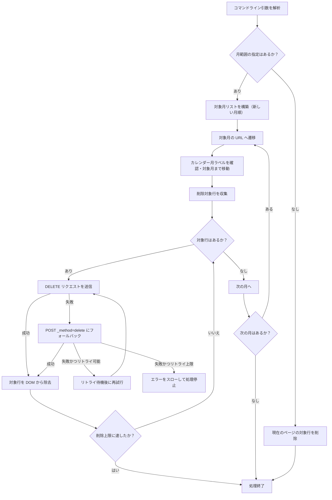

# 設計書

## 概要

### 背景・目的

背景：Money Forward ME の入出金明細を手動で削除する作業に時間と手間がかかっている。

目的：Playwright を用いて明細の削除操作を自動化し、作業効率を向上させる。

### 機能一覧

* このプログラムは、Microsoft Edge を自動操作して Money Forward ME の入出金一覧ページにアクセスし、手入力明細を上から順に削除します。
* 削除対象の月範囲（`--from-month` / `--to-month`）を指定することで、複数月にわたる明細を連続して削除できます。
* 削除リクエストの失敗時にはリトライ機能を用いて再試行します。
* `--dry-run` オプションで実際の削除を行わずに対象行を確認できます。

## 入力

### コマンドライン引数

| 引数 | データ型 | 説明 | 既定値 |
| ---- | ---- | ---- | ---- |
| `--dry-run` | flag | 実際の削除を行わず対象行のみログ出力する | false |
| `--headless` | flag | ブラウザをヘッドレスモードで起動する | false |
| `--keep-open` | flag | 処理完了後もブラウザを閉じない | false |
| `--max-deletes=N` | int | 削除件数の上限 | 無制限 |
| `--from-month=YYYY-MM` | string | 削除対象の開始月（新しい月側） | なし |
| `--to-month=YYYY-MM` | string | 削除対象の終了月（古い月側） | なし |
| `--concurrency=N` | int | 並列削除数 | 1 |
| `--retry-count=N` | int | 削除失敗時の最大リトライ回数 | 3 |
| `--retry-delay-ms=N` | int | リトライ間隔（ミリ秒） | 700 |

### 設定ファイル

| 項目 | 内容 |
| ---- | ---- |
| ファイル名 | `src/mfme.config.js` |
| 形式 | ES Module (JavaScript) |
| 内容概要 | セレクタ・URL・タイムアウトの設定 |

| キー名 | 説明 | 既定値 |
| ---- | ---- | ---- |
| `startUrl` | Money Forward ME の入出金一覧 URL | `https://moneyforward.com/cf` |
| `selectors.transactionRow` | 削除リンクを持つ明細行のセレクタ | `tr:has(td.delete a[data-method="delete"])` |
| `selectors.deleteTrigger` | 明細行の削除リンクのセレクタ | `td.delete a[data-method="delete"]` |
| `selectors.monthTitle` | 現在表示月ラベルのセレクタ | `#calendar .fc-header-title h2` |
| `selectors.loadingIndicator` | 読み込み中インジケーターのセレクタ | `#js-alert .alert:has-text("読み込み"), .loading, .spinner` |
| `timeouts.navigationMs` | ページ遷移タイムアウト（ミリ秒） | `30000` |
| `timeouts.actionMs` | 操作タイムアウト（ミリ秒） | `10000` |

## 出力

### コンソールログ

* 標準出力にのみ出力する（ファイルへの書き出しは行わない）。
* 「ログ出力」の章に記載する。

## 実行方法

初回はログイン状態を保存するため、ヘッドありで起動して一覧画面まで手動で遷移します。行が見つからない場合はブラウザが停止するので、その状態でログインして削除したい一覧画面まで遷移し、Playwright インスペクタから再開します。

```powershell
npm run delete:mfme -- --dry-run
```

実削除（最大50件）:

```powershell
npm run delete:mfme -- --max-deletes=50
```

全件を順に削除する場合:

```powershell
npm run delete:mfme
```

月の範囲を指定する場合（YYYY-MM 形式）:

```powershell
npm run delete:mfme -- --from-month=2026-04 --to-month=2025-10
```

## 想定実行環境

| 項目 | 内容 |
| ---- | ---- |
| OS | Windows 10 / Windows 11 |
| ブラウザ | Microsoft Edge（インストール済みであること） |
| Node.js | 18.x 以降 |
| npm パッケージ | playwright |

## 処理詳細

1. コマンドライン引数を解析し、実行オプションを決定する。
1. `--from-month` / `--to-month` が指定されている場合は対象月のリストを新しい月順に構築する。
1. `.mfme-profile` ディレクトリを使って Microsoft Edge のブラウザを永続コンテキストで起動する。
1. 月範囲が指定されていない場合は現在のページの対象行を削除して終了する。
1. 月範囲が指定されている場合は新しい月から順に対象月の URL へ遷移する。
1. カレンダーの月ラベルを確認し、対象月のページに正しく移動できたことを確認する（最大36ステップ移動）。
1. 削除対象行（手入力明細）のリストを収集する。
1. 各行の削除リンクの URL に対して DELETE リクエストを送信する（失敗時は POST with `_method=delete` にフォールバック）。
1. 削除に失敗した場合はリトライ設定に基づき再試行する。
1. 対象月の削除が完了したら次の月へ進む。



## ログ出力

### ログ出力概要

| 項目 | 内容 |
| ---- | ---- |
| 出力先 | 標準出力（stdout） / 標準エラー出力（stderr） |
| フォーマット | テキスト（プレフィックスなし） |

### ログ出力例

```text
範囲指定: from=2026-04 to=2025-10
範囲モード: 2026-04 -> 2025-10 (7ヶ月)
対象月: 2026-04
月: 2026/04/01
対象 1: 2026/04/10 食費 -1000 手入力
削除レスポンス: DELETE 200 https://moneyforward.com/... (attempt 1/4)
削除完了 1件
対象 2: 2026/04/15 交通費 -500 手入力
削除レスポンス: DELETE 429 https://moneyforward.com/... (attempt 1/4)
再試行 1/3: HTTP 429 のため 700ms 待機
削除レスポンス: DELETE 200 https://moneyforward.com/... (attempt 2/4)
削除完了 2件
対象月: 2026-03
月: 2026/03/01
この月に削除対象はありません。
...
処理終了: 2件
```

### ログメッセージ

| No. | 出力先 | テンプレート |
| ---- | ---- | ---- |
| 1 | stdout | `範囲指定: from={fromMonth} to={toMonth}` |
| 2 | stdout | `範囲モード: {newerLabel} -> {olderLabel} ({count}ヶ月)` |
| 3 | stdout | `対象月: {monthLabel}` |
| 4 | stdout | `月: {currentMonthLabel}` |
| 5 | stdout | `この月に削除対象はありません。` |
| 6 | stdout | `対象 {sequence}: {snapshot}` |
| 7 | stdout | `削除レスポンス: {method} {status} {url} (attempt {attempt}/{maxAttempts})` |
| 8 | stdout | `削除完了 {deletedCount}件` |
| 9 | stdout | `再試行 {attempt}/{maxAttempts-1}: HTTP {status} のため {waitMs}ms 待機` |
| 10 | stdout | `処理終了: {totalDeleted}件` |
| 11 | stdout | `keep-open が有効です。終了するには Playwright インスペクタで Resume してください。` |
| 12 | stderr | `処理に失敗しました。` |
| 13 | stderr | `削除リクエストが失敗しました: HTTP {status} ({method})` |

## ライセンス

### 本プログラムのライセンス

* このプログラムはMITライセンスに基づいて提供されます。

### 使用ライブラリーのライセンス

| ライブラリ名 | バージョン | ライセンス |
| ---- | ---- | ---- |
| playwright | 1.59.1 | Apache License 2.0 |

## 開発詳細

### 開発環境

| 項目 | バージョン |
| ---- | ---- |
| Node.js | v24.12.0 |
| npm | 11.7.0 |
| VSCode | 1.118.1 |
| Microsoft Edge | 147.0.3912.98 |

### セレクタ調整

Money Forward ME の DOM が環境によって違う場合は [src/mfme.config.js](src/mfme.config.js) の各セレクタを調整してください。まずは `--dry-run` で対象行のログが出るか確認し、その後に実削除へ切り替える運用を想定しています。

## 改訂履歴

| バージョン | 日付 | 内容 |
| ----- | ---------- | -------------- |
| 1.0.0 | 2026-05-02 | 初版リリース |
